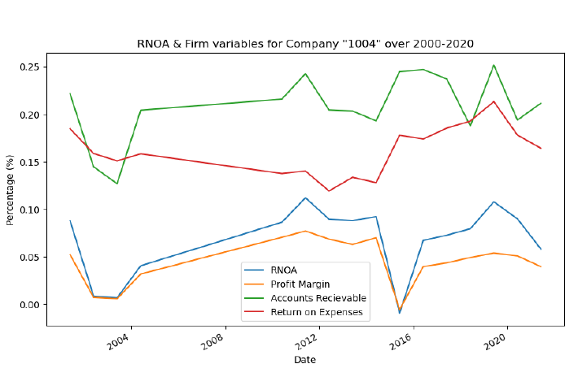
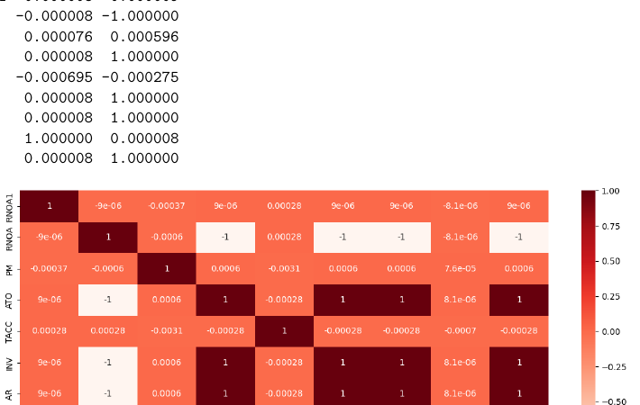

# Financial Forecasting in Python: RNOA and EPS



## Project overview

This project evaluates alternative methods for forecasting corporate financial performance using **Return on Net Operating Assets (RNOA)** and **Earnings per Share (EPS)**. It compares a multivariable accounting-ratio regression with simpler random-walk and moving-average forecasting approaches.

**Tools:** Python, pandas, NumPy, statsmodels, SciPy, matplotlib, seaborn, Jupyter Notebook.

## Analytical workflow

### RNOA analysis

- Construct Net Operating Assets and eight accounting ratios from firm-level financial data.
- Create one-period-ahead RNOA and ROA variables.
- Explore individual-firm time series.
- Examine correlations among present-period ratios and future RNOA.
- Fit OLS models for future ROA and future RNOA.
- Compare the regression forecast with a simple random-walk benchmark.

### EPS analysis

- Clean and winsorise EPS observations.
- Create one-, two- and three-period random-walk forecasts.
- Create two-, three- and five-year moving-average forecasts.
- Calculate forecast-error measures.
- Use t-tests to compare selected model-error differences.

## Selected findings

The fitted RNOA regression reported essentially **zero R-squared**, indicating that the selected present-period ratios did not explain future RNOA in the fitted model. The project therefore demonstrates the importance of benchmarking complex models against simple alternatives.

For EPS, the reported mean forecast-error figures were lowest for the three-year and five-year moving-average models relative to the random-walk alternatives, but the pairwise t-tests in the project did **not** establish statistically significant superiority at a conventional 5% level.

**Figure 2. Correlation heatmap of selected financial ratios.**



## Repository structure

```text
financial-forecasting-python/
├── financial_forecasting.ipynb
├── README.md
├── requirements.txt
├── .gitignore
├── data/
│   └── README.md
├── images/
│   ├── financial_ratio_correlation.png
│   └── firm_rnoa_example.png
└── report/
    └── financial_forecasting_report.pdf
```

## Reproducing the analysis

1. Add the two source datasets described in `data/README.md`.
2. Install the Python requirements:

```bash
pip install -r requirements.txt
```

3. Open `financial_forecasting.ipynb` in Jupyter and run the notebook from top to bottom.

## Interpretation

The central lesson from this project is that additional model complexity does not guarantee better forecasts. Forecasting methods should be compared with transparent baseline models and evaluated using out-of-sample error measures and statistical tests.
